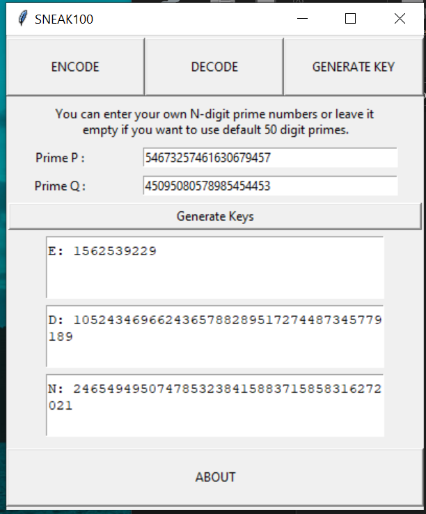
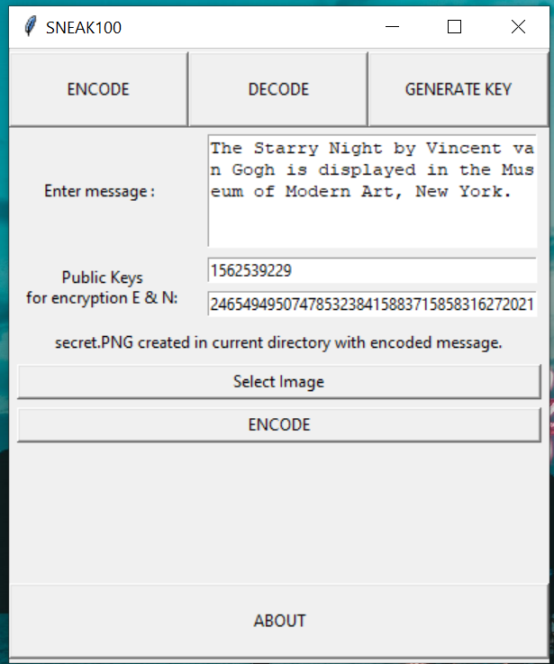
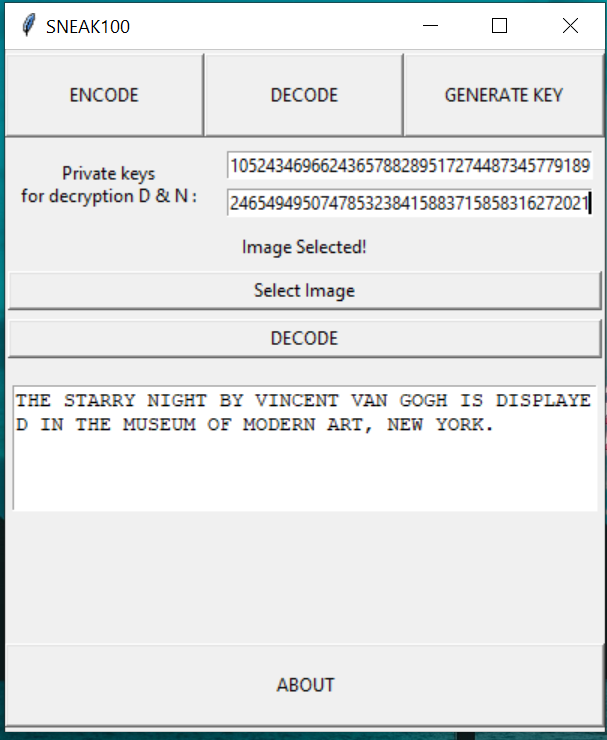

# SNEAK100

SNEAK100 is a GUI program allows you to hide texts within images. To make it more secure it encrypts the text before hiding the text. For encryption it uses a modified RSA algorithm. You can also generate your own unique realtime key pair for encryption and decryption that makes it even more secure.

## RSA Algorithm
RSA algorithm is asymmetric cryptography algorithm. Asymmetric actually means that it works on two different keys i.e. Public Key and Private Key. As the name describes that the Public Key is given to everyone and Private key is kept private. 

In our case, to encrypt your text you need a public key which is pair of two numbers `E` and `N`.
Each public key pair has a unique private key pair of two numbers `D` and `N`. 

If you want to receive some secret text from someone, just generate a set of public key and private key. Give the public key to sender who will use it to hide the text and keep the private key to yourself. When you receive the image from the sender you can decode it by using your private key only.

## Image Steganography
#### What is Image Steganography?
Steganography is the practice of concealing a file, message, image, or video within another file, message, image, or video.

The advantage of steganography over cryptography alone is that the intended secret message does not attract attention to itself as an object of scrutiny. Plainly visible encrypted messages, no matter how unbreakable they are, arouse interest and may in themselves be incriminating in countries in which encryption is illegal.

In other words, steganography is more discreet than cryptography when we want to send a secret information. On the other hand, the hidden message is easier to extract.

#### LSB based Data Embedding
LSB stands for Least Significant bit. The idea behind LSB embedding is that if we change the last bit value of a pixel, there won't be much visible change in the color.  In my program, I have modified the last four bits of R-Channel to store the encrypted message which is in hexadecimal form.
## Preview of Program
Entire code is written in Python3. PIL library is used for image manipulation steps. For GUI, I have used tkinter library which is standard Python interface to the Tk GUI toolkit, and is Python's de facto standard GUI. Tkinter is included with standard Linux, Microsoft Windows and Mac OS X installs of Python. If you dont have PIL installed in your system, you will need to install it.
For python version 3.X you need to specify : 
`sudo pip3 install pillow`

#### Screenshots
  

#### Precautions
- The encoded output image should not be compressed or resized during transmission otherwise it will get corrupt and hidden text will be lost. 

